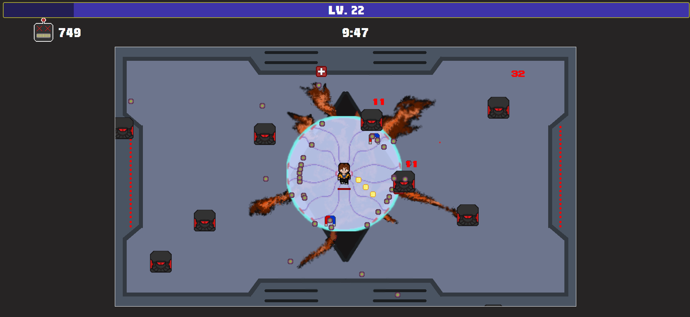
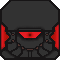
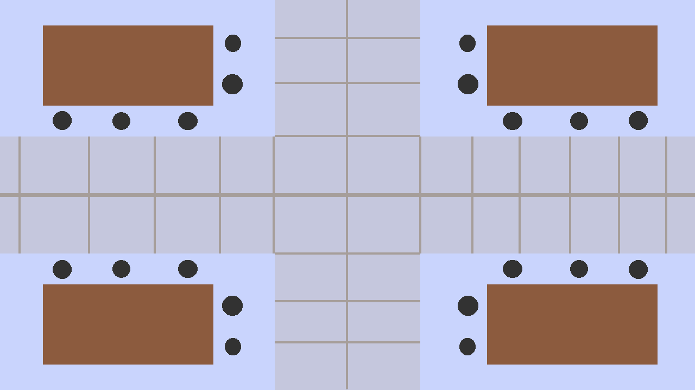

# Misty Survivor's: Endless Struggle
Defend yourself against endless waves of enemy robots and upgrade your character along the way.

## **Play the Game**
**Controls**: WASD-keys to move, ESC-key to pause the game
[Click here to play the game!](https://cc241008-20915.php.fhstp.cc/)

## Screenshots
### Main Gameplay:

  

---
### Main menu

  
  
*Figure 2: Menu and user interface.*

### **Spritesheets**
Below are the sprites used to create characters and objects in the game:

### Player character:

  
  
  
*Player character walking animation.*

### Enemies:

  
  
Enemy phase 1

   
  
Enemy phase 2

  
  
Enemy phase 3

   
  
Enemy phase 4

### Bullet and Collectables:

  
  
Bullet sprite

  
  
Experience Orb

  
  
Health kit

  
  
Magnet

### Electric Field:

  
  
Electric Field animation

### Backgrounds:

  
  
*Lab Background*

  
  
*Underground testing chamber*

  
  
*Background of a portal

  
  
*Background of a portal collapsing*

  
  
*Background of calamity*

## **Reflection**
### What went well:
- **Creative design**: creating various images and sprites (enemies, backgrounds, icons, weapons, etc.).
- **Learning new tools**: I learned how to do pixel art and explored new art tools like Aseprite and Libresprite along the way.
- **Discussing ideas**: It was a lot of fun discussing potential additions to the game with my colleagues. Overall, it was an interesting and enjoyable project to work on.

### Challenges: 
-  **Electric Field weapon**: Managing, and setting cooldowns, durations and intervals, I also focused on early difficulty, hit radius, and timing
-  **Game balancing**: Balancing the game, scaling enemies, and creating upgrades to enhance gameplay were key components of my work
 
### Lessons learned:
- **Solid foundation**: Building a solid foundation is really helpful, especially for later if other more complex will be added to the game.
- **Keep it Simple**: Focusing on one unique mechanic instead of multiple features made the game more polished and compact. 
